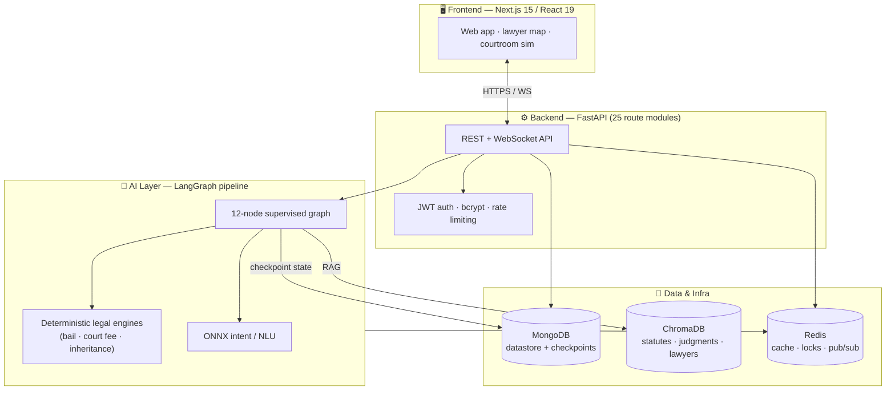

<div align="center">

# ⚖️ Attorney.AI

**An AI-powered legal assistance platform for Pakistani citizens.**

Grounded legal answers over real statutes and case law — with deterministic legal math handled by code, not guessed by a language model.


</div>

---

## Overview

Legal help in Pakistan is expensive, slow, and inaccessible to most people — and generic chatbots are *dangerous* for legal questions because they hallucinate statutes, invent case citations, and confidently miscalculate things like bail eligibility, court fees, and inheritance shares.

**Attorney.AI takes a different stance:** a language model should *explain and route*, but it should never be the source of truth for a citation or a legal calculation. So the system pairs a **retrieval-augmented LangGraph pipeline** (grounded in ingested Pakistani statutes and judgments) with a **deterministic tool layer** — court-fee, bail-eligibility, and Islamic-inheritance engines written as auditable code that the model *calls* rather than *guesses*.

> The operational consequence: if a bail answer is wrong, the question isn't "was the model having a bad day" — it's **"did the tool fire?"** That is a debuggable system, not a black box.

---

## Why this is engineered the way it is

These are the decisions a reviewer should notice:

| Decision | Why |
|---|---|
| **Deterministic engines as tools, not prompts** | Bail eligibility, court-fee, and inheritance math run as tested Python and are *called* by the model via a tool node. Legal numbers are never left to token prediction. |
| **Multi-stage grounding, not a single prompt** | A 12-node LangGraph pipeline separates *triage → retrieval → retrieval-grading → generation → hallucination-grading → finalization*, so a bad retrieval is caught before it becomes a bad answer. |
| **Hybrid retrieval** | ChromaDB dense vectors **+ BM25** lexical ranking — statutes are keyword-heavy ("Section 497 CrPC"), and pure embeddings miss exact references. |
| **Graceful degradation** | Redis (semantic cache, rate limits, WS pub/sub) is *optional* — the app degrades instead of dying when it's down. LLM providers are lazily imported with fallback. |
| **Reproducible AI stack** | Every LangChain/LangGraph dependency is pinned. AI infra that "works on my machine" is worthless; this reinstalls identically. |
| **No-torch embeddings** | Intent NLU and RAG embeddings use ONNX (`fastembed`) — fast cold starts, no multi-gigabyte PyTorch dependency. |
| **Pluggable LLM providers** | Groq (default), Gemini, OpenRouter, and local Ollama behind one interface — swap providers with one env var. |

---

## Architecture



### The AI pipeline

The legal-answer flow is a supervised **LangGraph** with dedicated nodes so each concern is isolated and independently testable:

```
triage → gatekeeper → retrieval → retrieval-grader → generation
       → hallucination-grader → tool-call (legal engines) → finalizer
```

Parallel **intake** and **clarification** sub-flows handle case-fact gathering, with their own hallucination guard. Conversation state is checkpointed in MongoDB, so multi-turn sessions survive restarts.

---

## Feature set

The backend exposes **25 route modules**. Highlights:

| Domain | What it does |
|---|---|
| ⚖️ **Legal AI chat** | Grounded Q&A over Pakistani statutes and case law with citation-aware generation |
| 🔍 **Citator** | Case-law lookup and citation graph over ingested LHC/superior-court judgments |
| 📋 **Cause lists** | Parses and surfaces court cause lists |
| 🔓 **Bail checker** | Deterministic bail-eligibility engine (bailable/non-bailable, CrPC-aware) |
| 🧮 **Calculators** | Court-fee and related legal calculators as audited code |
| 🕌 **Inheritance & Wasiyyat** | Islamic inheritance-share and will (wasiyyat) computation |
| ✍️ **Petition / pleading drafter** | RAG-assisted document generation, incl. Urdu translation + RTL PDF |
| 🌍 **Overseas desk** | Apostille, POA advisory, attested-document verification for overseas Pakistanis |
| 👨‍⚖️ **Lawyer matching** | Embedding-based lawyer discovery with an interactive map |
| 📅 **Appointments & engagements** | Booking, case management, client–lawyer engagements |
| 💳 **Payments & billing** | Subscription plans and payment integration (Safepay) |
| 🎙️ **Voice** | Speech-to-text intake via `faster-whisper` |
| 💬 **WhatsApp** | Conversational access over WhatsApp |
| 🔔 **Real-time notifications** | WebSocket fan-out backed by Redis pub/sub |

---

## Tech stack

**Backend** · FastAPI · Pydantic v2 · Uvicorn · Motor/PyMongo (MongoDB) · ChromaDB · Redis (async) · LangChain + LangGraph · `fastembed` (ONNX) · `rank-bm25` · `faster-whisper` · ReportLab + docxtpl · python-jose (JWT) · bcrypt · slowapi

**LLM providers** · Groq *(default)* · Google Gemini · OpenRouter · Ollama *(local)*

**Frontend** · Next.js 15 (App Router) · React 19 · Tailwind CSS · Framer Motion · GSAP · Lenis · Leaflet · Three.js (courtroom shaders)

---

## Project structure

```
attorney-ai/
├── backend/
│   ├── app/
│   │   ├── ai/
│   │   │   ├── graph/           # LangGraph supervisor, edges, state, checkpointer
│   │   │   ├── nodes/           # 12 pipeline nodes (triage, retrieval, hallucination…)
│   │   │   ├── tools/           # deterministic legal + document engines
│   │   │   ├── intent/          # ONNX NLU / intent detection
│   │   │   ├── pipelines/       # hybrid retriever (dense + BM25)
│   │   │   └── llm.py           # pluggable multi-provider LLM interface
│   │   ├── api/v1/routes/       # 25 REST/WS route modules
│   │   ├── services/            # business logic (payments, overseas, wasiyyat…)
│   │   ├── repositories/        # data access layer
│   │   ├── schemas/             # Pydantic models
│   │   └── core/                # config, security, rate limiting, exceptions
│   ├── scripts/                 # corpus ingestion (statutes, judgments)
│   ├── tests/                   # 21 test modules
│   └── RUNBOOK.md               # operational guide
└── frontend/
    └── src/app/                 # Next.js App Router (auth, admin, lawyer, features…)
```

---

## Getting started

### Prerequisites
- **Python 3.11+**, **Node.js 18+**
- **MongoDB** and **ChromaDB** running (required); **Redis** optional (recommended)
- At least one LLM provider API key (Groq / Gemini / OpenRouter, or a local Ollama)

### Backend

```bash
cd backend
python -m venv venv
venv/Scripts/pip install -r requirements.txt      # Windows
# source venv/bin/activate && pip install -r requirements.txt   # macOS/Linux

cp .env.example .env        # then fill in the values below

# Ingest the legal corpus (statutes → collections)
venv/Scripts/python scripts/ingest_pakistan_laws.py

# Run the API
venv/Scripts/uvicorn app.main:app --reload
```

API docs are then served at `http://localhost:8000/docs`.

### Frontend

```bash
cd frontend
npm install
npm run dev        # http://localhost:3000
```

### Configuration

Set these in `backend/.env` (see `.env.example` for the full list):

```dotenv
MONGODB_URL=mongodb://localhost:27017
LLM_PROVIDER=groq            # groq | gemini | openrouter | ollama
GROQ_API_KEY=...             # key for whichever provider you selected
REDIS_URL=                   # optional; leave empty to run without Redis
JWT_SECRET=...
```

---

## Testing

```bash
cd backend
venv/Scripts/python -m pytest        # 21 test modules
```

Tests cover the deterministic legal engines (bail, calculators, inheritance, wasiyyat), the graph routing, RAG tooling, payments, and the overseas-desk workflows — i.e. the parts where being *wrong* has real consequences.

---

## Status

Actively developed. Core platform, the LangGraph legal pipeline, deterministic legal engines, and the feature roadmap are implemented; production hardening (payment webhooks, corpus expansion) is ongoing.

---

## Author

**Muhammad Usama** — Computer Science, COMSATS University Islamabad.
Built as a final-year project.

## License

Released under the [MIT License](LICENSE).

> ⚠️ **Disclaimer:** Attorney.AI provides legal *information*, not legal *advice*, and does not create an attorney–client relationship. Always consult a licensed advocate for any actual legal matter.
